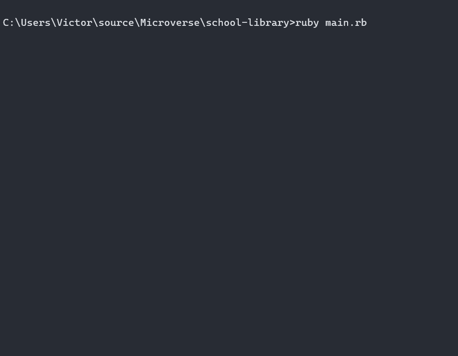

# School Library

A console application for a school library

## Built With

- Ruby

## Demo

## Getting Started

To get a local copy follow these simple example steps.  

1.- Open the terminal window and clone the repository using this command:  
`git clone git@github.com:VicPeralta/school-library.git` 

2.- Change the directory to the school-library directory  
`cd school-library`  
3.- Install the project's dependencies by running this command:   
`bundle install`  
4.- Run the program using this command:  
`ruby ./main.rb`  

## Authors

👤 **Victor Peralta**
- GitHub: [@VicPeralta](https://github.com/VicPeralta)
- Twitter: [@VicPeralta](https://twitter.com/VicPeralta)
- Linkedin: [@VicPeralta](https://www.linkedin.com/in/vicperalta/)

## 🤝 Contributing

Contributions, issues, and feature requests are welcome!

Feel free to check the [issues page](../../issues/).

## Show your support

Give a ⭐️ if you like this project!
The gem is available as open source under the terms of the [MIT License](https://opensource.org/licenses/MIT).
